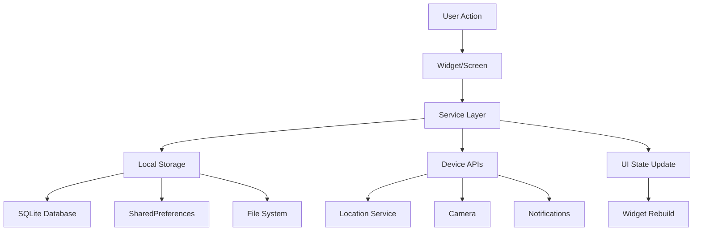

# 🏗️ Technical Architecture Guide

## Overview

Anchor is built using Flutter with a focus on simplicity, privacy, and offline functionality. This document provides detailed technical information about the app's architecture, design patterns, and implementation details.

## Architecture Patterns

### Service Layer Pattern

The app follows a **Service Layer Pattern** where business logic is separated from UI components:

```
UI Layer (Widgets) → Service Layer → Data Layer (Storage/APIs)
```

#### Benefits
- **Separation of Concerns**: UI logic separate from business logic
- **Testability**: Services can be unit tested independently
- **Reusability**: Services can be shared across multiple UI components
- **Maintainability**: Changes to business logic don't affect UI structure

### Data Flow Architecture



## Core Services

### LocationService (`lib/services/location_service.dart`)

Handles all GPS and location-related functionality:

#### Key Methods
```dart
// Permission handling
static Future<bool> checkPermissions()

// GPS location acquisition
static Future<Position?> getCurrentLocation()

// Address lookup
static Future<String?> reverseGeocode(double lat, double lon)

// Accuracy assessment
static ParkingLocationAccuracy getAccuracyLevel(double accuracyMeters)

// Navigation URL generation
static Future<String> launchNavigation(double lat, double lon, String? app)
```

#### Implementation Details
- **Timeout Handling**: 6-second GPS timeout to prevent hanging
- **Permission Flow**: Graceful permission request with fallbacks
- **Accuracy Classification**: High (<25m), Medium (25-75m), Low (>75m)
- **Error Handling**: Comprehensive error handling for GPS failures

### StorageService (`lib/services/storage_service.dart`)

Manages all local data persistence:

#### Database Schema
```sql
-- Parking spots table
CREATE TABLE parking_spots (
  id TEXT PRIMARY KEY,
  created_at INTEGER NOT NULL,
  latitude REAL NOT NULL,
  longitude REAL NOT NULL,
  accuracy_meters REAL NOT NULL,
  address TEXT,
  note TEXT,
  level_or_spot TEXT,
  media_ids TEXT,
  reminder_at INTEGER,
  source INTEGER NOT NULL DEFAULT 0,
  is_active INTEGER NOT NULL DEFAULT 0
);

-- Media assets table
CREATE TABLE media_assets (
  id TEXT PRIMARY KEY,
  spot_id TEXT NOT NULL,
  type TEXT NOT NULL,
  local_path TEXT NOT NULL,
  created_at INTEGER NOT NULL,
  FOREIGN KEY (spot_id) REFERENCES parking_spots (id) ON DELETE CASCADE
);

-- Performance indexes
CREATE INDEX idx_active_spots ON parking_spots (is_active);
CREATE INDEX idx_created_at ON parking_spots (created_at DESC);
```

#### Key Features
- **Single Active Spot**: Only one parking spot can be active at a time
- **Auto Cleanup**: Maintains maximum of 50 historical spots
- **Media Management**: Handles photo storage and cleanup
- **Settings Persistence**: Uses SharedPreferences for app settings

### NotificationService (`lib/services/notification_service.dart`)

Handles reminder notifications with multiple fallback strategies:

#### Notification Strategy
1. **Primary**: Native Android AlarmManager (most reliable)
2. **Secondary**: Flutter Local Notifications
3. **Fallback**: In-app Timer (for immediate testing)

#### Key Methods
```dart
// Schedule reminder with native alarm
static Future<void> scheduleReminder({
  required int id,
  required String title,
  required String body,
  required DateTime scheduledTime,
})

// Show immediate notification
static Future<void> showImmediate({
  required int id,
  required String title,
  required String body,
})

// Cancel all notifications
static Future<void> cancelAll()
```

## Data Models

### ParkingSpot Model

The core data model representing a saved parking location:

```dart
class ParkingSpot {
  // Identification
  final String id;                    // UUID for unique identification
  final DateTime createdAt;           // Timestamp when spot was saved
  
  // Location data
  final double latitude;              // GPS latitude coordinate
  final double longitude;             // GPS longitude coordinate
  final double accuracyMeters;        // GPS accuracy in meters
  final String? address;              // Human-readable address
  
  // User data
  final String? note;                 // User-provided notes
  final String? levelOrSpot;          // Floor/section information
  final List<String> mediaIds;       // Photo references
  
  // Functionality
  final DateTime? reminderAt;         // Reminder notification time
  final SaveSource source;            // How the spot was saved
  final bool isActive;                // Currently active spot flag
}
```

#### Computed Properties
```dart
// GPS accuracy level (High/Medium/Low)
ParkingLocationAccuracy get accuracy

// Human-readable accuracy description
String get accuracyLabel
String get accuracyHint

// Time calculations
Duration get timeSinceSaved
String get timeAgoLabel
```

### Save Sources

Represents how a parking spot was created:

```dart
enum SaveSource {
  manual,              // User manually saved
  btDisconnect,        // Bluetooth disconnect trigger
  carplayDisconnect,   // CarPlay disconnect trigger
  ssidDisconnect,      // WiFi disconnect trigger
}
```

### App Settings Model

Manages user preferences and configuration:

```dart
class AppSettings {
  final String distanceUnit;          // 'km' or 'miles'
  final int? defaultDurationMinutes;  // Default parking duration
  final bool askDurationOnSave;       // Prompt for duration
  final String? defaultNavigationApp; // Preferred navigation app
  final bool privacyLocalOnly;        // Local storage only (always true)
  final String language;              // App language
  final bool showAccuracyHints;       // Show GPS accuracy guidance
}
```

## UI Architecture

### Screen Hierarchy

```
MaterialApp
└── HomeScreen (Main interface)
    ├── Navigation to HistoryScreen
    ├── Navigation to SettingsScreen
    ├── Modal: SaveSpotSheet
    └── Modal: NavigationOptionsSheet
```

### Widget Composition

#### PrimaryActionButton
Large, prominent button that changes based on app state:
- **No Active Spot**: "Save Parking Spot" with parking icon
- **Has Active Spot**: "Navigate to Car" with navigation icon
- **Visual Feedback**: Scale animation on press

#### CurrentSpotCard
Displays information about the currently active parking spot:
- **Location Info**: Address or coordinates
- **Time Information**: How long ago the spot was saved
- **GPS Accuracy**: Visual indicator and description
- **Actions**: Delete, Navigate, Mark as Arrived

#### SaveSpotSheet
Bottom sheet modal for saving new parking spots:
- **Location Display**: Current GPS coordinates and accuracy
- **Photo Capture**: Camera integration for spot identification
- **Notes Input**: Text fields for additional information
- **Reminder Setup**: Optional time-based reminders

### State Management Strategy

#### Why Simple setState()?

Anchor deliberately uses Flutter's built-in `setState()` instead of complex state management solutions:

**Advantages:**
- **Simplicity**: Easy to understand and debug
- **Performance**: Minimal overhead for small app
- **Maintenance**: Less dependencies and complexity
- **Team Friendly**: No learning curve for new developers

**When it works well:**
- Small to medium app size
- Clear data flow
- Minimal shared state
- Service layer handles business logic

#### State Management Pattern

```dart
class _ScreenState extends State<Screen> {
  // Local state variables
  bool _isLoading = false;
  ParkingSpot? _currentSpot;
  AppSettings _settings = AppSettings();
  
  @override
  void initState() {
    super.initState();
    _loadData(); // Load initial data
  }
  
  Future<void> _loadData() async {
    setState(() => _isLoading = true);
    try {
      // Call service layer
      final spot = await StorageService.getActiveSpot();
      final settings = await StorageService.getSettings();
      
      // Update UI state
      setState(() {
        _currentSpot = spot;
        _settings = settings;
      });
    } finally {
      setState(() => _isLoading = false);
    }
  }
  
  Future<void> _handleUserAction() async {
    // Call service layer
    await SomeService.performAction();
    
    // Reload data to reflect changes
    await _loadData();
  }
}
```

## Platform Integration

### Android-Specific Features

#### Native Alarm Service
Custom Kotlin implementation for reliable notifications:

```kotlin
// NativeAlarmService.kt
class NativeAlarmService {
    companion object {
        fun scheduleNativeAlarm(
            context: Context,
            id: Int,
            title: String,
            body: String,
            scheduledTime: Long
        ): Boolean
    }
}
```

#### Permissions Handling
- **Runtime Permissions**: Requested when needed
- **Exact Alarms**: Required for reliable reminders on Android 12+
- **Location Services**: Fine and coarse location access
- **Camera Access**: Optional for photo functionality

### File System Organization

```
/data/data/com.dash_laifu.anchor/
├── databases/
│   └── parking_spots.db           # SQLite database
├── files/
│   └── media/                     # Photo storage
│       ├── spot_123_photo.jpg
│       └── spot_456_photo.jpg
└── shared_prefs/
    └── flutter.FlutterSharedPreferences.xml  # App settings
```

## Performance Considerations

### Database Optimization

#### Indexing Strategy
```sql
-- Active spot lookup (most frequent query)
CREATE INDEX idx_active_spots ON parking_spots (is_active);

-- History listing (frequent query)
CREATE INDEX idx_created_at ON parking_spots (created_at DESC);
```

#### Query Patterns
```dart
// Efficient active spot lookup
final activeSpot = await db.query(
  'parking_spots',
  where: 'is_active = 1',
  limit: 1,
);

// Paginated history with search
final history = await db.query(
  'parking_spots',
  where: 'is_active = 0 AND note LIKE ?',
  whereArgs: ['%$searchQuery%'],
  orderBy: 'created_at DESC',
  limit: 20,
);
```

### Memory Management

#### Image Handling
- **Compression**: Photos compressed to max 1200px width
- **Local Storage**: Images stored in app documents directory
- **Cleanup**: Automatic deletion when spots are removed

#### Widget Lifecycle
```dart
class _WidgetState extends State<Widget> with TickerProviderStateMixin {
  late AnimationController _controller;
  
  @override
  void initState() {
    super.initState();
    _controller = AnimationController(vsync: this);
  }
  
  @override
  void dispose() {
    _controller.dispose(); // Prevent memory leaks
    super.dispose();
  }
}
```

### Battery Optimization

#### GPS Usage
- **Quick Acquisition**: 6-second timeout prevents hanging
- **One-time Requests**: No continuous location tracking
- **Permission Scope**: Only when needed, not in background

#### Notification Strategy
- **Native Alarms**: Use Android AlarmManager (minimal battery impact)
- **No Background Processing**: App doesn't run in background
- **Efficient Scheduling**: Single alarm per reminder

## Security & Privacy

### Data Protection

#### Local-Only Storage
```dart
// All data stays on device
class StorageService {
  static Future<Database> get database async {
    // Local SQLite database only
    final path = join(await getDatabasesPath(), 'parking_spots.db');
    return openDatabase(path, version: 1, onCreate: _createTables);
  }
}
```

#### No Network Communications
- **No API Calls**: App doesn't make network requests
- **No Analytics**: No usage tracking or telemetry
- **No Cloud Sync**: All data remains local

#### Photo Privacy
```dart
// Photos stored in app-private directory
static Future<String> getMediaDirectory() async {
  final directory = await getApplicationDocumentsDirectory();
  final mediaDir = Directory(join(directory.path, 'media'));
  return mediaDir.path; // Private to app, not accessible by other apps
}
```

### Permission Minimization

#### Required Permissions
- **Location**: Essential for core functionality
- **Camera**: Optional, only for photos
- **Exact Alarms**: Optional, only for reminders

#### Graceful Degradation
```dart
// App works even with limited permissions
Future<Position?> getCurrentLocation() async {
  final hasPermission = await checkPermissions();
  if (!hasPermission) {
    return null; // App handles gracefully
  }
  // Continue with location acquisition
}
```

## Testing Strategy

### Unit Testing Approach

#### Service Layer Testing
```dart
// Example service test
group('StorageService', () {
  test('should save and retrieve parking spot', () async {
    final spot = ParkingSpot(/* test data */);
    await StorageService.saveParkingSpot(spot);
    
    final retrieved = await StorageService.getActiveSpot();
    expect(retrieved?.id, equals(spot.id));
  });
});
```

#### Widget Testing
```dart
// Example widget test
testWidgets('PrimaryActionButton shows correct text', (tester) async {
  await tester.pumpWidget(MaterialApp(
    home: PrimaryActionButton(
      hasActiveSpot: false,
      onPressed: () {},
      isLoading: false,
    ),
  ));
  
  expect(find.text('Save Parking Spot'), findsOneWidget);
});
```

### Integration Testing

#### End-to-End Scenarios
1. **Save Spot Flow**: GPS → Save → Confirmation
2. **Navigation Flow**: Saved Spot → Navigate → External App
3. **Reminder Flow**: Set Reminder → Notification → Action
4. **History Flow**: Multiple Spots → Search → View Details

### Debug Features

#### Notification Testing
```dart
// Built-in testing widget for development
class NotificationTestWidget {
  static void show(BuildContext context) {
    // Test immediate notifications
    // Test scheduled reminders
    // Test native alarms
    // Verify permissions
  }
}
```

## Build & Deployment

### Build Configuration

#### Flutter Build Commands
```bash
# Debug build with debugging enabled
flutter build apk --debug

# Release build optimized for distribution
flutter build apk --release --obfuscate --split-debug-info=build/symbols

# App bundle for Play Store
flutter build appbundle --release
```

#### Build Scripts
```powershell
# scripts/build.ps1
flutter clean
flutter pub get
flutter build apk --release --obfuscate --split-debug-info=build/symbols
```

### Version Management

#### Versioning Strategy
```yaml
# pubspec.yaml
version: 1.0.0+1
#        │ │ │ │
#        │ │ │ └── Build number (increment for each release)
#        │ │ └──── Patch version (bug fixes)
#        │ └────── Minor version (new features)
#        └──────── Major version (breaking changes)
```

### Release Checklist

#### Pre-Release Testing
- [ ] Test on multiple Android versions
- [ ] Verify GPS accuracy in different environments
- [ ] Test notification reliability
- [ ] Validate permission flows
- [ ] Check memory usage and performance
- [ ] Verify offline functionality

#### Security Review
- [ ] No hardcoded secrets or API keys
- [ ] Proper permission handling
- [ ] Data privacy compliance
- [ ] Secure file storage

## Troubleshooting & Debugging

### Common Development Issues

#### GPS Testing
```dart
// Debug GPS accuracy issues
Logger.d('GPS Position: lat=${position.latitude}, lon=${position.longitude}');
Logger.d('GPS Accuracy: ${position.accuracy}m');
Logger.d('GPS Provider: ${position.locationAccuracy}');
```

#### Database Debugging
```dart
// Debug database operations
Future<void> debugDatabase() async {
  final db = await database;
  final spots = await db.query('parking_spots');
  Logger.d('Total spots in database: ${spots.length}');
  
  for (final spot in spots) {
    Logger.d('Spot: ${spot['id']}, active: ${spot['is_active']}');
  }
}
```

#### Notification Debugging
```dart
// Test notification system
await NotificationService.testNativeAlarm();
final pending = await NotificationService.getPendingNotifications();
Logger.d('Pending notifications: ${pending.length}');
```

### Performance Debugging

#### Memory Profiling
- Use Flutter Inspector to identify widget rebuilds
- Monitor database query performance
- Check image memory usage
- Verify animation controller disposal

#### Battery Testing
- Test notification reliability across device sleep cycles
- Verify GPS doesn't run in background
- Check alarm manager usage

## Future Considerations

### Scalability Planning

#### Database Growth
- Current limit: 50 spots with auto-cleanup
- Could increase to 200-500 spots if needed
- Consider data compression for large histories

#### Feature Expansion
- Multiple active spots for different vehicles
- Cloud backup (optional, with explicit user consent)
- Integration with smart car systems
- Sharing spots with family members

### Technology Evolution

#### Flutter Updates
- Monitor Flutter stable releases
- Update dependencies regularly
- Migrate to new Material Design updates
- Consider Flutter Desktop support

#### Platform Features
- Android Auto integration
- Wear OS companion app
- iOS CarPlay support
- Smart home integration (park/leave triggers)

---

This technical documentation provides a comprehensive overview of Anchor's architecture, implementation details, and development practices. It serves as a reference for current development and future enhancements while maintaining the app's core principles of simplicity, privacy, and reliability.
